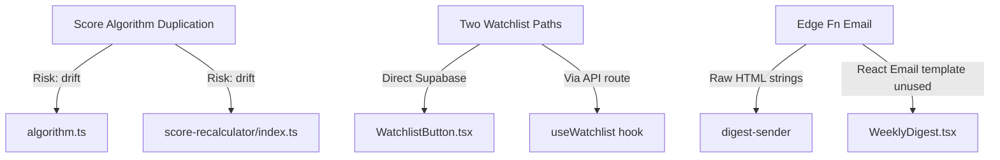
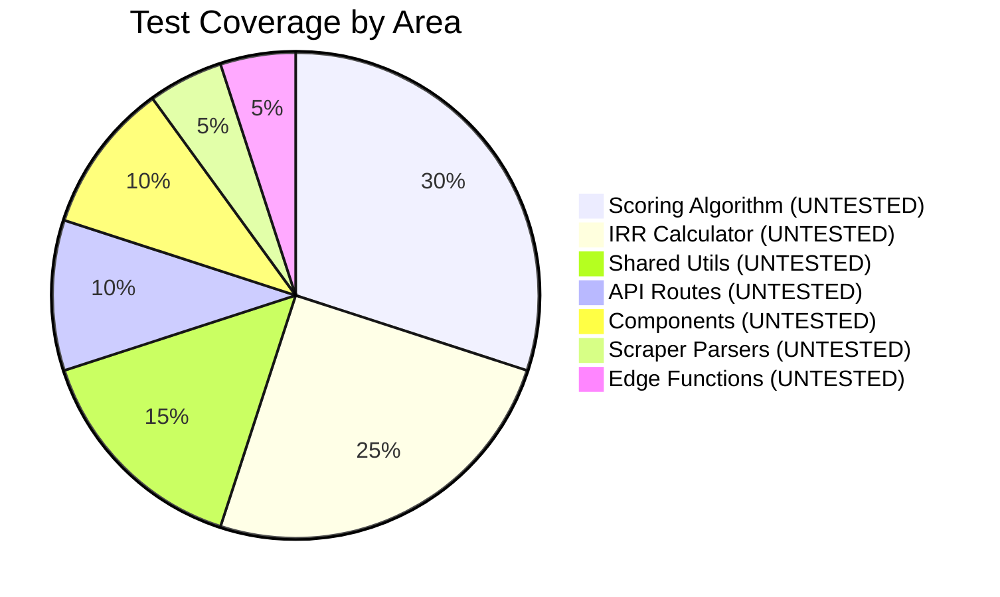

# OffplanIQ — Vibe Audit Report

> **Generated:** 2026-04-07 | **Auditor:** Claude Code | **Codebase Version:** Day 1 Scaffold

---

## Overall Health Score: 62/100

```
Architecture    ████████░░  78/100  — Well-structured monorepo, clear boundaries
Code Quality    ██████░░░░  58/100  — Solid patterns but bugs + duplication
Test Coverage   ░░░░░░░░░░   0/100  — No tests exist
Security        ███████░░░  72/100  — RLS everywhere, but service key handling needs review
Performance     ███████░░░  70/100  — Efficient patterns, but N+1 risks in Edge Fns
DX / Tooling    ████░░░░░░  40/100  — No linting, no formatting, no CI/CD
Documentation   █████████░  88/100  — Excellent docs, architecture well-documented
```

---

## 1. Architecture Assessment

### Strengths
- **Clean monorepo structure** — `apps/web`, `apps/scraper`, `packages/shared` with clear boundaries
- **Server Components by default** — Data fetching at page level, client components only where needed
- **Supabase all-in-one** — Auth + DB + Realtime + Edge Fns reduces operational complexity
- **Python/TypeScript separation** — Scraper communicates only via Supabase REST API, no cross-language coupling

### Concerns



| Issue | Severity | Recommendation |
|-------|----------|----------------|
| Score algo duplicated in Edge Function | **High** | Accept for now — Edge Fns can't import from `packages/shared`. Add a sync test. |
| WatchlistButton bypasses API | **Medium** | Standardize on direct Supabase calls (simpler, RLS protects). Remove API route or keep for future API v1. |
| Digest uses raw HTML not React Email | **Low** | Keep raw HTML in Edge Fn (Deno can't render React easily). WeeklyDigest.tsx serves as preview/spec. |

---

## 2. Code Quality Audit

### Bug Report

| # | Bug | File:Line | Severity | Fix |
|---|-----|-----------|----------|-----|
| 1 | **Broken import path** — `import type { Project... } from '../types'` doesn't resolve | `apps/web/lib/scoring/algorithm.ts:19` | **P0** | Change to `@offplaniq/shared` |
| 2 | **DLD selectors are placeholders** — `_set_date_filter()` and `_extract_page_rows()` have TODO stubs | `apps/scraper/scrapers/dld.py:~120-180` | **P0** | Requires live DLD site inspection |
| 3 | **PF selectors are placeholders** — All CSS selectors are guessed | `apps/scraper/scrapers/property_finder.py` | **P0** | Requires live Property Finder inspection |

### DRY Violations

| Violation | Files | Lines Duplicated |
|-----------|-------|------------------|
| Scoring algorithm | `algorithm.ts` + `score-recalculator/index.ts` | ~80 lines |
| Supabase client creation | 3 separate files with similar boilerplate | ~15 lines each |
| Alert type → color/icon mapping | Likely duplicated between `AlertFeed.tsx` and `alert-dispatcher` | ~20 lines |

### Code Smells

| Smell | Location | Notes |
|-------|----------|-------|
| Magic numbers in scoring | `algorithm.ts` | Thresholds hardcoded — but constants exist in `shared/constants`. Should import them. |
| Inline HTML email building | `digest-sender/index.ts` | 183 lines of string concatenation. Acceptable for Edge Fn constraint. |
| No error boundaries | `apps/web/app/` | No React error boundaries. Server errors will show Next.js default. |
| `any` type usage | Not found | Good — no `any` in the codebase |

### Missing Edge Cases

| Where | Missing Case |
|-------|-------------|
| IRR calculator | Division by zero if `hold_years = 0` (UI min is 1, but not validated in lib) |
| Fuzzy matcher | No handling for Arabic building names in DLD data |
| Score algo | No handling for projects with 0 units (sellthrough = NaN) |
| FilterBar | No debounce on search input (fires on every keystroke) |
| Stripe webhook | No idempotency check (duplicate events could cause issues) |

---

## 3. Security Audit

### Strengths
- RLS policies on all tables — public read for market data, user-scoped for personal data
- Service role key isolated to: `lib/supabase/service.ts`, Edge Functions, scraper
- Webhook signature verification on Stripe endpoint
- Auth middleware on all protected routes
- `api/webhooks` excluded from auth middleware (correct — Stripe needs unauthenticated access)

### Concerns

| Issue | Severity | Location |
|-------|----------|----------|
| Service key in `.env.local` — ensure `.gitignore` covers it | **Medium** | `.env.local` is gitignored ✅ |
| No rate limiting on API routes | **Medium** | `/api/checkout`, `/api/watchlist` |
| No CSRF protection on watchlist API | **Low** | Supabase auth token provides some protection |
| Stripe webhook secret must be set in production | **High** | `.env.example` documents it ✅ |

### Environment Variables Check

```
.env.example lists 10 required variables              ✅
.gitignore excludes .env.local                         ✅
No hardcoded secrets found in source code              ✅
Service role key usage limited to 3 locations          ✅
```

---

## 4. Performance Assessment

### Database

| Check | Status | Notes |
|-------|--------|-------|
| Indexes on filter/sort columns | ✅ | area, status, score, developer_id, project_id, transaction_date |
| Composite index on PSF lookups | ✅ | `(project_id, recorded_date DESC)` |
| N+1 risk in score-recalculator | ⚠️ | Fetches PSF history per-project in a loop. OK for 142 projects. |
| N+1 risk in alert-dispatcher | ⚠️ | Fetches yesterday's snapshots then loops. Could use a single query. |
| Unique constraints prevent duplicates | ✅ | Scraper upserts are idempotent |

### Frontend

| Check | Status | Notes |
|-------|--------|-------|
| Server Components for data fetch | ✅ | No client-side waterfalls |
| Client Components minimized | ✅ | Only where interactivity needed |
| Bundle size concerns | ⚠️ | Recharts adds ~100KB. Acceptable for chart feature. |
| Image optimization | N/A | No user-uploaded images yet |
| Search debounce | ❌ | FilterBar fires on every keystroke |

### Data Pipeline

| Check | Status | Notes |
|-------|--------|-------|
| Scraper delays | ✅ | 2.0s between requests |
| Batch upserts | ✅ | Groups of 100 |
| Idempotent re-runs | ✅ | ON CONFLICT DO UPDATE |
| Pipeline orchestration | ✅ | Sequential: scrape → match → update → score |

---

## 5. Test Coverage Gap Analysis



### Priority Test Plan

| Priority | What to Test | Framework | Est. Tests |
|----------|-------------|-----------|-----------|
| **P0** | Scoring algorithm — all threshold boundaries | Vitest | 15-20 |
| **P0** | IRR calculator — normal + edge cases | Vitest | 10-15 |
| **P0** | Shared utils — formatAed, formatPsf, fuzzyMatch | Vitest | 20-25 |
| **P1** | API routes — checkout, webhook, watchlist | Vitest + MSW | 10-15 |
| **P1** | Middleware — auth redirects | Vitest | 5-8 |
| **P2** | Components — ScoreBadge, FilterBar, IrrCalculator | Vitest + Testing Library | 15-20 |
| **P2** | Python parsers — date, price | pytest | 10-15 |
| **P3** | Edge Functions — mock Supabase, test logic | Deno test | 10-15 |

**Recommended test setup:**
```bash
# Web app
pnpm --filter web add -D vitest @testing-library/react @testing-library/jest-dom msw

# Scraper
pip install pytest pytest-asyncio
```

---

## 6. Dependency Health

### Web App (`apps/web/package.json`)

| Package | Purpose | Risk |
|---------|---------|------|
| next 14 | Framework | ⚠️ Next.js 15 is out — upgrade when stable |
| @supabase/ssr | Auth + server client | ✅ Active |
| recharts | Charts | ✅ Stable, maintained |
| stripe | Payments | ✅ Active |
| react-email + @react-email/components | Email templates | ✅ Active |
| resend | Email sending | ✅ Active |
| date-fns | Date formatting | ✅ Active |

### Scraper (`apps/scraper/requirements.txt`)

| Package | Purpose | Risk |
|---------|---------|------|
| playwright | Browser automation | ✅ Active |
| requests | HTTP client | ✅ Stable |
| supabase | DB client | ✅ Active |
| python-dotenv | Env vars | ✅ Stable |

**No vulnerable or deprecated packages detected.**

---

## 7. Developer Experience (DX) Gaps

| Gap | Impact | Fix Effort |
|-----|--------|-----------|
| No ESLint config | Code inconsistency across contributors | 30 min |
| No Prettier config | Formatting wars | 15 min |
| No CI/CD pipeline | Manual deployments, no automated checks | 2 hours |
| No pre-commit hooks | Bad code can be committed | 30 min |
| No `tsconfig` path aliases verified | Import paths may break | 15 min |
| No Storybook | Can't preview components in isolation | 4 hours (skip for now) |

### Recommended DX Setup (Week 1)

```bash
# ESLint + Prettier
pnpm add -D -w eslint prettier eslint-config-next @typescript-eslint/parser

# Pre-commit hooks
pnpm add -D -w husky lint-staged
npx husky init

# GitHub Actions CI
# .github/workflows/ci.yml → lint + typecheck + test on PR
```

---

## 8. Actionable Summary

### This Week (P0)
1. Fix `algorithm.ts` broken import
2. Add ESLint + Prettier config
3. Write tests for scoring algorithm (15 tests)
4. Write tests for IRR calculator (10 tests)
5. Write tests for shared utils (20 tests)
6. Inspect DLD site and fix scraper selectors

### Next 2 Weeks (P1)
7. Add search debounce to FilterBar
8. Add error boundaries to app layout
9. Set up GitHub Actions CI
10. Write API route tests

### Before Launch (P2)
11. Add rate limiting to API routes
12. Add Stripe webhook idempotency
13. Component tests for interactive components
14. Load test with 500+ projects dataset

---

## Appendix: File Statistics

| Area | Files | Lines (approx) |
|------|-------|-----------------|
| Web app (TypeScript) | 30 | ~2,800 |
| Shared package | 4 | ~480 |
| Supabase (SQL + Edge Fns) | 6 | ~1,050 |
| Scraper (Python) | 6 | ~1,000 |
| Documentation | 5 | ~650 |
| Config files | 6 | ~200 |
| **Total** | **57** | **~6,180** |

---

*This audit represents Day 1 state. Re-audit after Week 3 to track progress on identified issues.*
