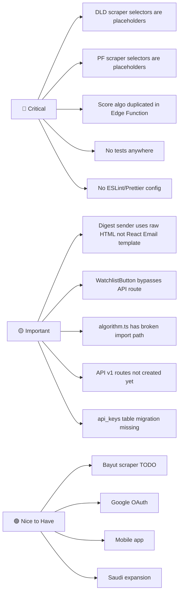
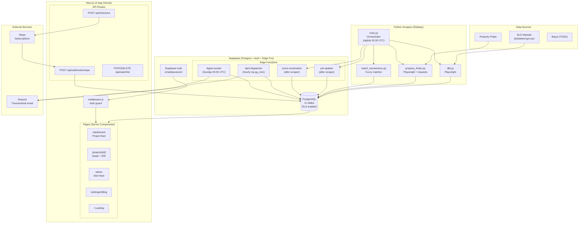
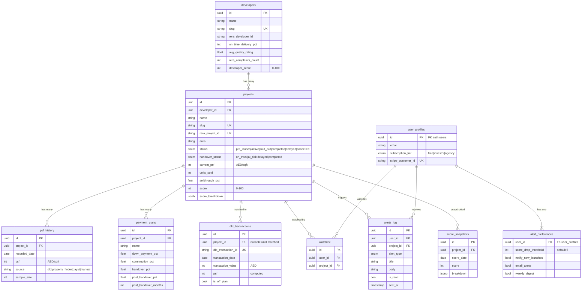
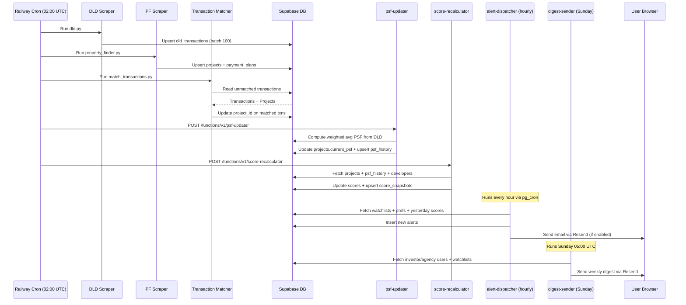
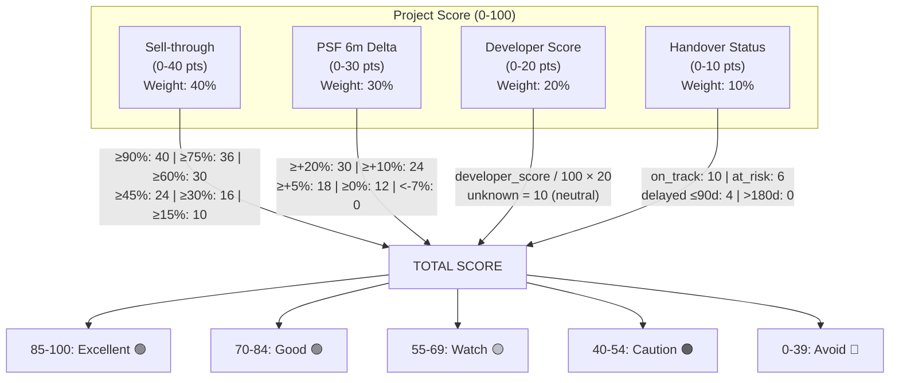
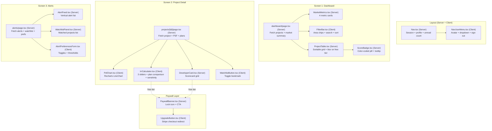
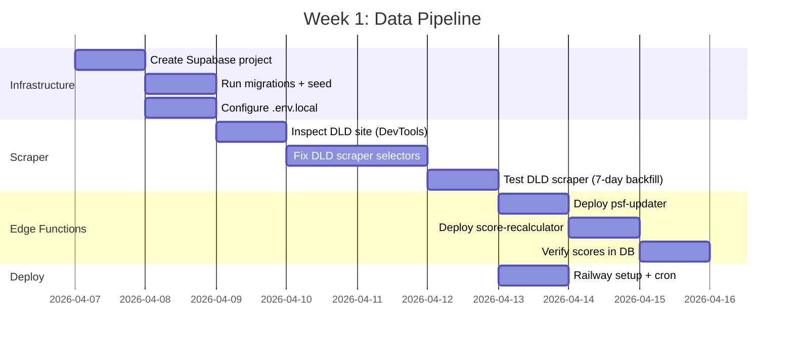
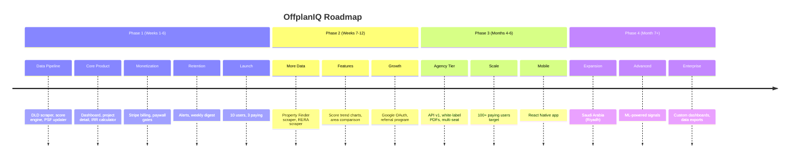

# PLAN.md — OffplanIQ Day 1 Master Plan

> **Date:** 2026-04-07 | **Status:** Day 1 — Foundation & Planning
> **Goal:** Go from scaffolded codebase → production-ready data pipeline + deployed dashboard in 6 weeks

---

## Executive Summary

OffplanIQ is a Dubai off-plan property intelligence SaaS that gives investors and brokers a Bloomberg-like view of 142+ active off-plan projects. The core moat is the **scoring algorithm** (weighted formula: sell-through 40% + PSF trend 30% + developer 20% + handover 10%) and the **IRR calculator** that lets users compare payment plans side-by-side.

### Revenue Model
| Plan | Price | Target |
|------|-------|--------|
| Free | AED 0 | Top 20 projects, 30-day lag, no IRR/alerts |
| Investor | AED 750/mo (AED 7,500/yr) | Full access, live data, alerts, IRR |
| Agency | AED 3,500/mo (AED 35,000/yr) | 5 seats + API + white-label PDFs |

### Success Metrics (Week 6)
- 10 beta users, 3 paying (AED 2,250+ MRR)
- 142+ projects with live PSF data
- Score accuracy validated against manual analysis
- Sunday digest retention > 60% open rate

---

## Current State Assessment

### What Exists (Scaffolded)
```
✅ Complete DB schema (2 migrations, 11 tables, RLS policies, triggers)
✅ All TypeScript types (packages/shared/types)
✅ All shared constants (tier limits, score weights, pricing)
✅ All utility functions (formatting, math, fuzzy matching)
✅ Scoring algorithm (apps/web/lib/scoring/algorithm.ts)
✅ IRR calculator (apps/web/lib/irr/calculator.ts)
✅ All 14 React components (pages + features + UI + charts)
✅ Auth middleware with protected routes
✅ 3 Supabase clients (browser, server, service)
✅ Stripe checkout + webhook routes
✅ Watchlist API route
✅ 4 Edge Functions (score-recalculator, alert-dispatcher, digest-sender, psf-updater)
✅ 2 Python scrapers (DLD, Property Finder) + transaction matcher
✅ Seed script with 5 sample projects
✅ Full documentation (architecture, API spec, screen specs, data sources)
✅ Turbo monorepo config
```

### What Needs Work (Critical Gaps)



---

## Architecture Overview



---

## Database Schema (ERD)



---

## Data Flow Pipeline



---

## Scoring Algorithm Deep Dive



---

## Component Architecture



---

## Week-by-Week Execution Plan

### Week 1 — Data Pipeline (CURRENT PRIORITY)



**Day 1 Tasks (Today):**
- [x] Review entire codebase and create documentation
- [ ] Create Supabase project
- [ ] Run 001 + 002 migrations
- [ ] Fill `.env.local`
- [ ] Run seed script — verify 5 projects in dashboard

**Day 2-3:**
- [ ] Open DLD site, inspect network tab for XHR vs HTML
- [ ] Update `dld.py` selectors based on real DOM
- [ ] Get DLD pulling yesterday's transactions

**Day 4-5:**
- [ ] Deploy `psf-updater` and `score-recalculator` Edge Functions
- [ ] Run full pipeline: scrape → match → update PSF → recalculate scores
- [ ] Validate: 5+ projects have scores and PSF history

**Day 6-7:**
- [ ] Deploy scraper to Railway
- [ ] Set nightly cron (02:00 UTC)
- [ ] Monitor first automated run

### Week 2 — Core Dashboard
- Set up Next.js project structure
- Configure Tailwind + install shadcn/ui
- Wire up Supabase Auth (email/password)
- Build middleware, login, register
- Build dashboard page with all components
- Deploy to Vercel

### Week 3 — Project Detail + IRR
- Build project detail page
- Wire up PSF chart with real data
- Make IRR calculator interactive
- Build developer scorecard
- Build watchlist toggle + API
- Test IRR with 10 scenarios

### Week 4 — Alerts + Digest
- Build alerts page with all components
- Deploy alert-dispatcher, set hourly cron
- Set up Resend, verify domain
- Fix digest-sender to use React Email template
- Deploy digest-sender, set Sunday cron
- Send first test digest

### Week 5 — Billing + Polish
- Set up Stripe products (AED currency)
- Test checkout + webhook flow
- Add paywall gates everywhere
- Add ESLint + test suite
- Fix known bugs (see below)

### Week 6 — Launch
- Pre-launch checklist (20 items)
- Landing page
- Launch channels: FB group, LinkedIn, broker DMs, ProductHunt

---

## Known Bugs & Technical Debt

### P0 — Must Fix Before Launch

| # | Issue | File | Fix |
|---|-------|------|-----|
| 1 | DLD scraper selectors are placeholders | `apps/scraper/scrapers/dld.py` | Inspect live DLD site, update selectors |
| 2 | PF scraper selectors are placeholders | `apps/scraper/scrapers/property_finder.py` | Inspect live PF site, update selectors |
| 3 | Score algorithm duplicated | `algorithm.ts` + `score-recalculator/index.ts` | Extract shared module or accept sync risk |
| 4 | Broken import in algorithm.ts | `apps/web/lib/scoring/algorithm.ts:19` | Change `'../types'` → `'@offplaniq/shared'` |
| 5 | No test coverage | Entire codebase | Add unit tests for scoring, IRR, utils at minimum |

### P1 — Fix Before Week 4

| # | Issue | File | Fix |
|---|-------|------|-----|
| 6 | Digest sender uses raw HTML, not React Email | `supabase/functions/digest-sender/index.ts` | Render `WeeklyDigest.tsx` or keep raw HTML (simpler for Edge Fn) |
| 7 | WatchlistButton bypasses API route | `components/project/WatchlistButton.tsx` | Use `/api/watchlist` route or accept direct Supabase calls |
| 8 | No ESLint/Prettier config | Root | Add `eslint.config.js` + `.prettierrc` |

### P2 — Post-Launch

| # | Issue | Fix |
|---|-------|-----|
| 9 | API v1 routes not created | Build when agency tier has customers |
| 10 | `api_keys` migration missing | Create `003_api_keys.sql` |
| 11 | Bayut scraper TODO | Build after DLD + PF are stable |

---

## Risk Register

| Risk | Likelihood | Impact | Mitigation |
|------|-----------|--------|------------|
| DLD changes DOM structure | High | Critical — no data | Monitor scraper failures, alert on 0 transactions |
| Supabase free tier limits | Medium | High — downtime | Upgrade to Pro ($25/mo) before launch |
| Stripe AED not available | Low | High — no revenue | Fallback to USD pricing |
| Score formula perceived as wrong | Medium | Medium — trust loss | Show breakdown on hover, publish methodology |
| Scraper gets IP-blocked | Medium | High — no data | Rotate proxies, add delays, respect robots.txt |

---

## Decision Log

| Date | Decision | Rationale |
|------|----------|-----------|
| 2026-04-07 | No ML in scoring | Investors trust explainable formulas. ML later as premium signal |
| 2026-04-07 | Python for scrapers, TS for everything else | Playwright Python more mature for complex scraping |
| 2026-04-07 | Supabase Edge Fns for cron | No extra infra. pg_cron triggers functions directly |
| 2026-04-07 | AED integers (no decimals) | Property prices don't need sub-AED precision |
| 2026-04-07 | Free tier: 20 projects, 30-day lag | Enough to demonstrate value, not enough to replace paid |

---

## Post-Launch Roadmap



---

## File Map (Quick Reference)

```
offplaniq/
├── apps/
│   ├── web/
│   │   ├── app/
│   │   │   ├── page.tsx                    # Landing page
│   │   │   ├── layout.tsx                  # Root layout + fonts
│   │   │   ├── globals.css                 # Tailwind imports
│   │   │   ├── dashboard/page.tsx          # Screen 1: Project feed
│   │   │   ├── projects/[id]/page.tsx      # Screen 2: Detail + IRR
│   │   │   ├── alerts/page.tsx             # Screen 3: Alerts
│   │   │   ├── settings/billing/page.tsx   # Subscription management
│   │   │   ├── auth/login/page.tsx         # Login
│   │   │   ├── auth/register/page.tsx      # Register
│   │   │   └── api/
│   │   │       ├── checkout/route.ts       # Stripe checkout session
│   │   │       ├── webhooks/stripe/route.ts# Stripe webhook handler
│   │   │       └── watchlist/route.ts      # Watchlist CRUD
│   │   ├── components/
│   │   │   ├── project/                    # 9 feature components
│   │   │   ├── charts/PsfChart.tsx         # Recharts wrapper
│   │   │   ├── layout/Nav.tsx + NavUserMenu.tsx
│   │   │   └── ui/PaywallBanner.tsx + UpgradeButton.tsx
│   │   ├── hooks/                          # useProjects, useWatchlist, useAlerts
│   │   ├── lib/
│   │   │   ├── scoring/algorithm.ts        # THE scoring formula
│   │   │   ├── irr/calculator.ts           # IRR computation
│   │   │   └── supabase/{client,server,service}.ts
│   │   └── emails/WeeklyDigest.tsx         # React Email template
│   └── scraper/
│       ├── main.py                         # Orchestrator
│       ├── scrapers/dld.py                 # DLD transaction scraper
│       ├── scrapers/property_finder.py     # PF listing scraper
│       ├── jobs/match_transactions.py      # Fuzzy matcher
│       └── parsers/{date,price}.py         # Parse helpers
├── packages/shared/
│   ├── types/index.ts                      # All TypeScript interfaces
│   ├── constants/index.ts                  # Tiers, weights, pricing, areas
│   └── utils/index.ts                      # Formatting, math, dates
├── supabase/
│   ├── migrations/001_initial_schema.sql   # 11 tables, RLS, triggers
│   ├── migrations/002_cron_and_rpc.sql     # Views + RPC functions
│   ├── functions/                          # 4 Edge Functions
│   └── seed/seed.sql                       # 5 sample projects
├── docs/                                   # Architecture, API, specs
├── scripts/seed.ts                         # Seed runner
├── PLAN.md                                 # ← YOU ARE HERE
└── CLAUDE.md                               # AI coding instructions
```

---

*This plan is a living document. Update it as decisions are made and milestones are hit.*
