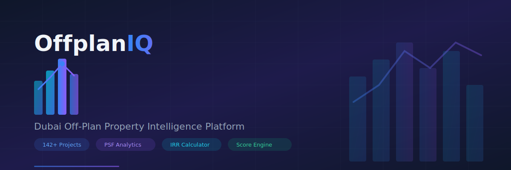
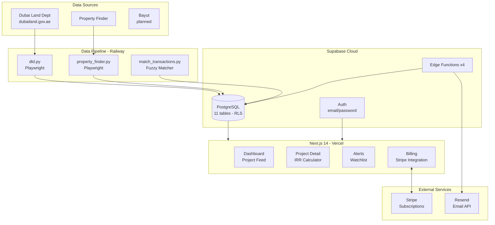
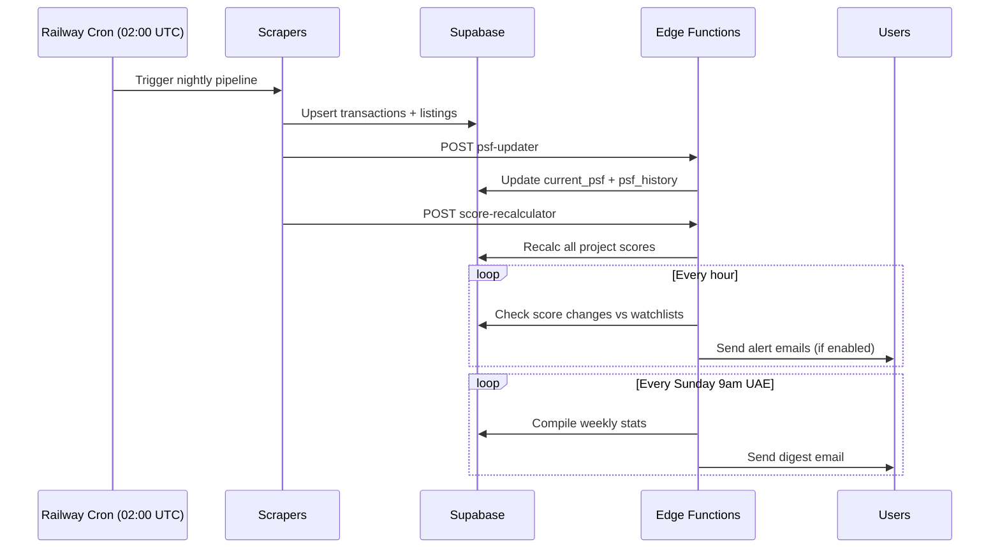
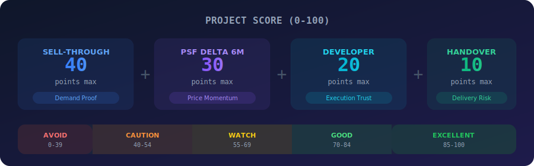
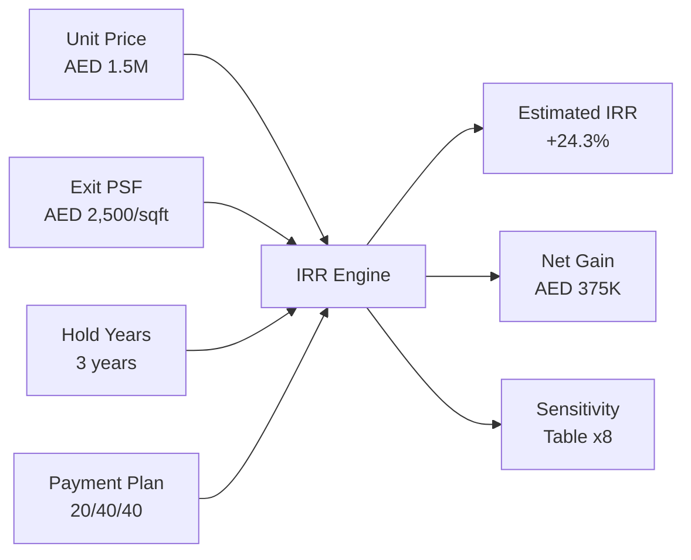
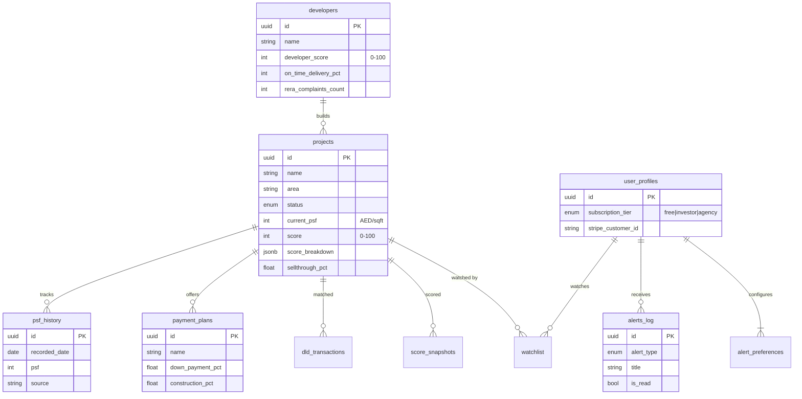
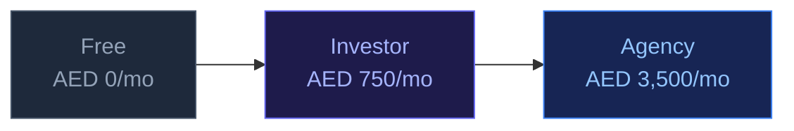
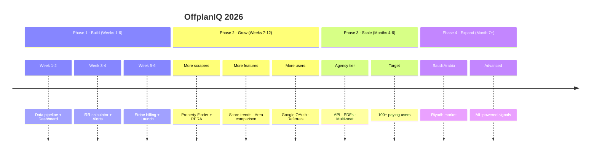

<p align="center">
  
</p>

<p align="center">
  <strong>Bloomberg for Dubai off-plan real estate.</strong><br/>
  Track 142+ active projects with PSF analytics, scoring engine, IRR calculators, and developer scorecards.
</p>

<p align="center">
  <a href="#-quick-start"></a>
  <a href="#-architecture"></a>
  <a href="#-scoring-engine"></a>
  <a href="PLAN.md"></a>
</p>

<p align="center">
  
  
  
  
  
  
  
</p>

---

## What is OffplanIQ?

OffplanIQ is a SaaS intelligence platform for **UAE property investors and brokers**. It aggregates data from Dubai Land Department, Property Finder, and developer sites to provide:

- **Project Scoring (0-100)** — Weighted formula combining sell-through velocity, PSF momentum, developer track record, and handover risk
- **IRR Calculator** — Compare payment plans side-by-side with sensitivity analysis
- **Real-time Alerts** — Score drops, PSF spikes, handover delays pushed via email
- **Developer Scorecards** — RERA complaints, on-time delivery %, quality ratings

### Who is this for?

| User | Value Prop |
|------|-----------|
| **Individual Investors** | Stop guessing — know which project has the best risk-adjusted returns |
| **Property Brokers** | Data-backed recommendations that close deals faster |
| **Real Estate Agencies** | White-label reports + API access for your team of 5 |

---

## 🚀 Quick Start

```bash
# Clone
git clone git@github.com:vishalm/OffplanIQ.git && cd OffplanIQ

# Install dependencies
pnpm install

# Set up environment (see .env.example for details)
cp .env.example .env.local

# Run database migrations
pnpm supabase db push

# Seed sample data (5 projects + 3 developers)
pnpm run seed

# Start the web app
pnpm --filter web dev        # → http://localhost:3000

# Run tests
pnpm --filter web test       # 95 TypeScript tests
cd apps/scraper && pytest     # 71 Python tests
```

---

## 🏗 Architecture



### Data Flow



### Tech Stack

| Layer | Technology | Why |
|-------|-----------|-----|
| **Frontend** | Next.js 14 (App Router) | Server Components, streaming, Vercel deploy |
| **Database** | Supabase (Postgres + RLS) | Auth + DB + Realtime + Edge Fns in one |
| **Styling** | Tailwind CSS | Utility-first, zero custom CSS |
| **Charts** | Recharts | React-native, lightweight |
| **Payments** | Stripe | AED subscriptions, webhooks, portal |
| **Email** | Resend + React Email | Best DX for transactional email |
| **Scraping** | Python + Playwright | Handles JS-rendered government sites |
| **CI/CD** | GitHub Actions | Lint + typecheck + 166 tests on every PR |
| **Hosting** | Vercel + Railway | Both have generous free tiers |

---

## 📊 Scoring Engine

<p align="center">
  
</p>

The score is the product. Every alert, digest, and investor decision is built on this number.

```
Score (0-100) = Sell-through (40) + PSF Delta (30) + Developer (20) + Handover (10)
```

**Why this formula?**
- **Sell-through (40%)** — Demand is the strongest signal. 90%+ sold means the market validated this project.
- **PSF Delta (30%)** — 6-month price momentum. Rising PSF = capital appreciation = what investors want.
- **Developer (20%)** — On-time delivery, RERA complaints, quality ratings. Execution trust.
- **Handover (10%)** — Is it on track? Delays kill investor ROI (especially with payment plan structures).

> **Design principle:** No ML. Fully explainable. Investors trust it because they understand every point.

See [docs/scoring-methodology.md](docs/scoring-methodology.md) for the full deep dive.

---

## 💰 IRR Calculator

The key paid feature. An investor managing a AED 1.5M purchase will pay AED 750/mo just to see this number.



**Key insight:** Lower down payment = less cash at risk = higher IRR on the same property. This is why comparing payment plans is the killer feature.

---

## 🗃️ Database Schema



11 tables, all with RLS policies. Public read for market data, user-scoped for personal data.

See [docs/data-model.md](docs/data-model.md) for the complete schema reference.

---

## 💳 Subscription Tiers



| Feature | Free | Investor | Agency |
|---------|:----:|:--------:|:------:|
| Projects visible | Top 20 | All 142+ | All 142+ |
| PSF data | 30-day lag | Live (T+1) | Live (T+1) |
| IRR calculator | — | ✅ | ✅ |
| Developer scorecard | — | ✅ | ✅ |
| Score breakdown | — | ✅ | ✅ |
| Alerts & digest | — | ✅ | ✅ |
| API access | — | — | ✅ |
| White-label PDFs | — | — | ✅ |
| Seats | 1 | 1 | 5 |

---

## 📁 Project Structure

```
offplaniq/
├── apps/
│   ├── web/                          # Next.js 14 (App Router)
│   │   ├── app/                      # Pages (Server Components)
│   │   │   ├── dashboard/            # Screen 1: Project feed
│   │   │   ├── projects/[id]/        # Screen 2: Detail + IRR
│   │   │   ├── alerts/               # Screen 3: Alerts & watchlist
│   │   │   ├── settings/billing/     # Stripe subscription
│   │   │   └── api/                  # Checkout, webhook, watchlist
│   │   ├── components/               # 14 React components
│   │   ├── lib/
│   │   │   ├── scoring/algorithm.ts  # ⭐ THE scoring formula
│   │   │   └── irr/calculator.ts     # ⭐ IRR computation
│   │   ├── hooks/                    # useProjects, useWatchlist, useAlerts
│   │   └── __tests__/               # 95 Vitest tests
│   └── scraper/                      # Python data pipeline
│       ├── scrapers/                 # DLD + Property Finder
│       ├── jobs/                     # Transaction matcher
│       ├── parsers/                  # Date + price parsers
│       └── tests/                    # 71 pytest tests
├── packages/shared/                  # Types, constants, utils
├── supabase/
│   ├── migrations/                   # 001 + 002 SQL migrations
│   ├── functions/                    # 4 Edge Functions
│   └── seed/                         # Sample data
├── docs/                             # Architecture + API + specs
├── gh-pages/                         # Documentation site
├── PLAN.md                           # 6-week build plan
└── AUDIT.md                          # Codebase health audit
```

---

## 🧪 Testing

```bash
# TypeScript tests (scoring, IRR, utils)
pnpm --filter web test               # 95 tests

# Python tests (date parser, price parser)
cd apps/scraper && pytest -v          # 71 tests

# Watch mode
pnpm --filter web test:watch
```

| Suite | Tests | What's covered |
|-------|------:|---------------|
| `scoring.test.ts` | 31 | All score components, thresholds, labels |
| `irr.test.ts` | 20 | IRR calc, plan comparison, sensitivity table |
| `utils.test.ts` | 44 | Formatting, math, fuzzy matching, dates |
| `test_date_parser.py` | 34 | Quarter, month, ISO, edge cases |
| `test_price_parser.py` | 37 | AED/PSF parsing, ranges, sanity checks |

---

## 🔧 Development

```bash
# Run everything locally
pnpm --filter web dev                 # Web app on :3000
supabase functions serve              # Edge functions locally
stripe listen --forward-to localhost:3000/api/webhooks/stripe

# Scraper (separate terminal)
python apps/scraper/scrapers/dld.py --days 7

# Add a database migration
supabase migration new your_feature_name
# Edit the file, then:
supabase db push
```

---

## 📚 Documentation

| Document | Description |
|----------|------------|
| [PLAN.md](PLAN.md) | 6-week build plan with Gantt charts and milestones |
| [AUDIT.md](AUDIT.md) | Codebase health audit (62/100) with action items |
| [Architecture Overview](docs/architecture/overview.md) | System diagram, data freshness, key decisions |
| [Data Model](docs/data-model.md) | Complete database schema with ERD |
| [Scoring Methodology](docs/scoring-methodology.md) | Deep dive into the scoring formula |
| [API Reference](docs/api/overview.md) | Agency-tier REST API spec |
| [Data Sources](docs/data-sources/overview.md) | How data gets into the system |
| [Screen Specs](docs/screens/specs.md) | UI specifications for all 3 screens |

---

## 🗺️ Roadmap



---

<p align="center">
  <sub>Built with obsessive attention to Dubai off-plan market data.</sub><br/>
  <sub>Made with ❤️ by <a href="https://github.com/vishalm">@vishalm</a></sub>
</p>
