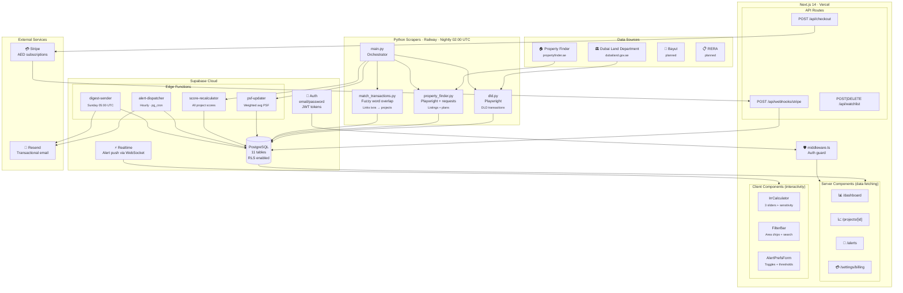
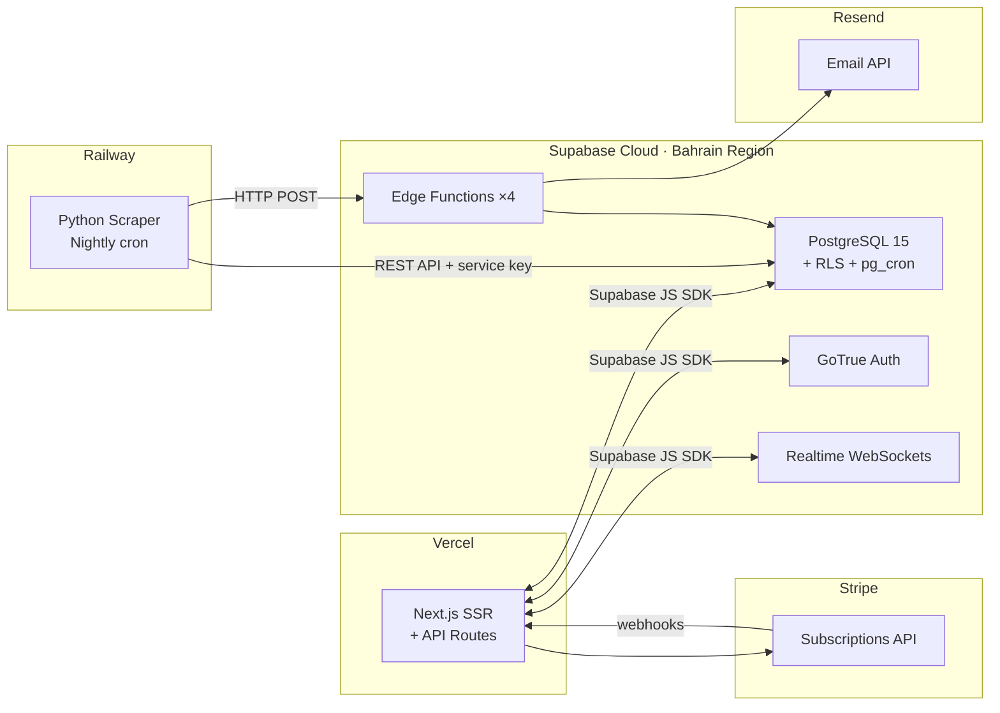
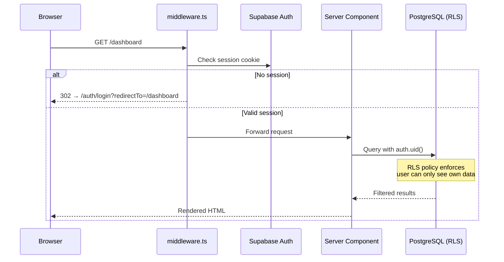
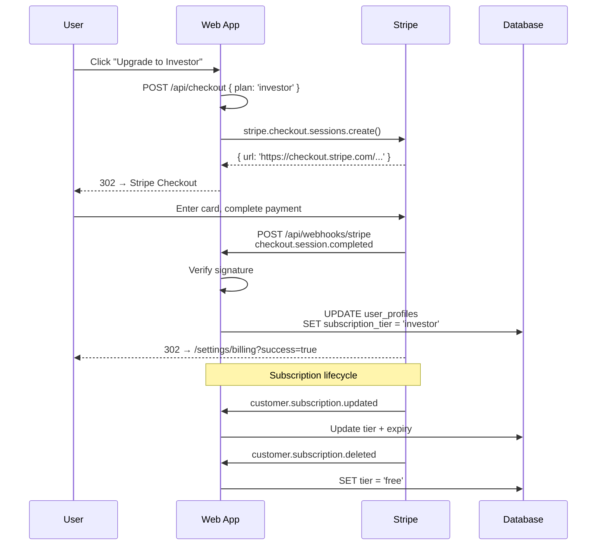
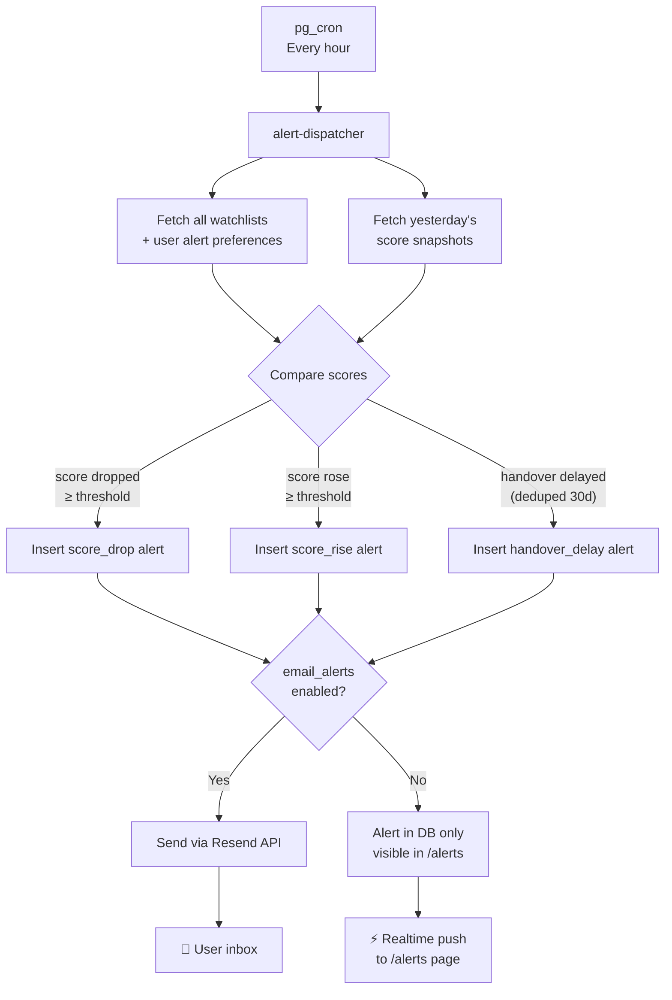
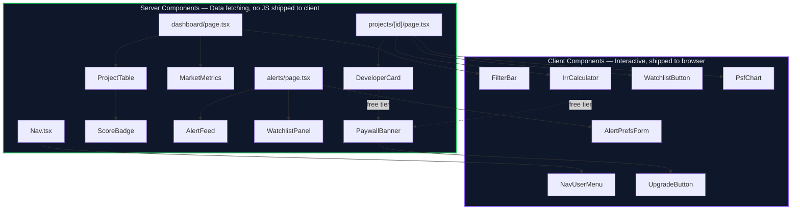

# Architecture Overview

  

## System Architecture

---

## Deployment Topology

> **No self-hosted database.** Supabase Cloud is the single backend — DB, Auth, Realtime, Edge Functions, cron, and storage all in one. Zero database ops.

### Why Supabase for everything?
- **One platform** = PostgreSQL + Auth + Realtime + Edge Functions + pg_cron + Storage
- **Zero database ops** — no backups, no scaling, no patching to manage
- **RLS baked in** — security at the database layer, not the application layer
- **Edge Functions** replace Lambda/Cloud Functions for scheduled jobs
- **pg_cron** replaces external cron services for hourly alerts and weekly digests
- **Realtime** pushes alert counts to the UI without polling
- **$25/mo Pro plan** covers all needs for the first 1000 users

---

## Data Freshness

| Data | Source | Frequency | Lag | Pipeline Stage |
|------|--------|-----------|-----|---------------|
| DLD transactions | dubailand.gov.ae | Daily 02:00 UTC | T+1 | `dld.py` → `dld_transactions` |
| PSF history | Computed from DLD | After scraper | T+1 | `psf-updater` → `psf_history` |
| Project listings | Property Finder | Every 6h | ~1h | `property_finder.py` → `projects` |
| Payment plans | Property Finder | Every 6h | ~1h | `property_finder.py` → `payment_plans` |
| Project scores | Edge Function | After scraper | T+1 | `score-recalculator` → `projects.score` |
| Score snapshots | Edge Function | Daily | T+1 | `score-recalculator` → `score_snapshots` |
| Alerts | Edge Function | Hourly | <1h | `alert-dispatcher` → `alerts_log` |
| Weekly digest | Edge Function | Sunday 05:00 UTC | Weekly | `digest-sender` → email |

---

## Authentication & Authorization Flow

### Three Supabase Clients

| Client | File | Used By | Has RLS |
|--------|------|---------|---------|
| Browser | `lib/supabase/client.ts` | Client Components | Yes — user JWT |
| Server | `lib/supabase/server.ts` | Server Components, Route Handlers | Yes — user JWT via cookie |
| Service | `lib/supabase/service.ts` | Webhooks, Edge Functions, scraper | **No** — bypasses RLS |

---

## Stripe Subscription Flow

---

## Alert Pipeline

---

## Component Architecture

---

## Key Design Decisions

| Decision | Rationale |
|----------|-----------|
| **No ML in scoring** | Investors trust formulas they can understand. ML later as "premium signal" |
| **Python scrapers, TS everything else** | Playwright Python is more mature for complex scraping. Clean boundary via REST API |
| **Supabase for everything** | DB + Auth + Realtime + Edge Fns + cron + storage in one. Zero database ops to manage |
| **No self-hosted Postgres** | Supabase Cloud handles backups, scaling, patching. Docker only runs the web app |
| **AED integers (no decimals)** | Property prices don't need sub-AED precision. Simpler math, no floating point errors |
| **Server Components by default** | Less JS shipped. Client Components only where user interaction is required |
| **RLS on everything** | Security at the database layer. Can't accidentally leak user data even if app code has bugs |
| **Score algorithm duplicated in Edge Fn** | Deno Edge Functions can't import from monorepo packages. Accepted tradeoff with sync test |

---

## Security Model

| Layer | Mechanism |
|-------|-----------|
| **Network** | HTTPS everywhere (Vercel + Supabase enforce TLS) |
| **Authentication** | Supabase Auth with JWT. Session in HTTP-only cookie |
| **Authorization** | RLS policies — user sees only own watchlist, alerts, profile |
| **API Protection** | middleware.ts guards all `/dashboard`, `/projects`, `/alerts`, `/settings` |
| **Webhook Verification** | Stripe signature checked with `constructEvent()` |
| **Service Key Isolation** | Only in 3 files: `service.ts`, Edge Functions, scraper env |
| **Secrets** | `.env.local` gitignored. No hardcoded credentials |
