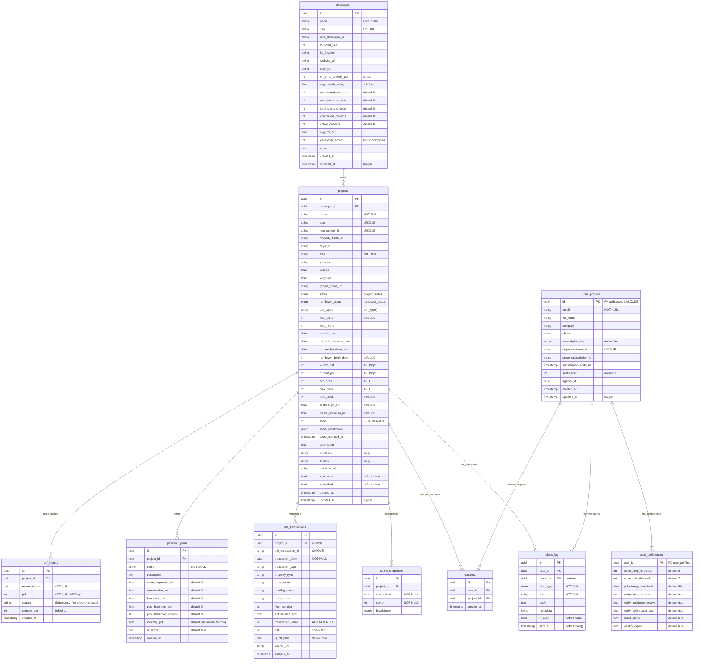

# Data Model Reference

Complete database schema for OffplanIQ. All tables live in Supabase (PostgreSQL 15) with Row Level Security enabled.

---

## Entity Relationship Diagram



---

## Enums

```sql
-- Project lifecycle
CREATE TYPE project_status AS ENUM (
  'pre_launch', 'active', 'sold_out', 'completed', 'delayed', 'cancelled'
);

-- Handover risk assessment
CREATE TYPE handover_status AS ENUM (
  'on_track', 'at_risk', 'delayed', 'completed'
);

-- Apartment types tracked
CREATE TYPE unit_type AS ENUM (
  'studio', '1br', '2br', '3br', '4br', 'penthouse', 'villa', 'townhouse'
);

-- Alert categories
CREATE TYPE alert_type AS ENUM (
  'score_drop', 'score_rise', 'new_launch', 'handover_delay',
  'psf_spike', 'psf_drop', 'sellthrough_stall', 'developer_flag'
);

-- Subscription plans
CREATE TYPE subscription_tier AS ENUM ('free', 'investor', 'agency');
```

---

## Indexes

| Table | Index | Purpose |
|-------|-------|---------|
| `projects` | `area` | Filter by Dubai area |
| `projects` | `status` | Filter active/pre_launch |
| `projects` | `score DESC` | Sort by score on dashboard |
| `projects` | `developer_id` | Join to developers |
| `psf_history` | `(project_id, recorded_date DESC)` | PSF chart queries |
| `dld_transactions` | `project_id` | Join matched transactions |
| `dld_transactions` | `transaction_date DESC` | Recent transactions |
| `dld_transactions` | `area_name` | Fuzzy matching pre-filter |
| `alerts_log` | `(user_id, sent_at DESC)` | User's alert feed |

---

## Unique Constraints

| Table | Constraint | Purpose |
|-------|-----------|---------|
| `developers` | `slug` | URL-safe identifier |
| `projects` | `slug` | URL routing |
| `projects` | `rera_project_id` | Dedup from RERA |
| `psf_history` | `(project_id, recorded_date, source)` | One PSF per source per day |
| `dld_transactions` | `dld_transaction_id` | Dedup from DLD |
| `watchlist` | `(user_id, project_id)` | One watch per user per project |
| `alert_preferences` | `user_id` | One preferences row per user |
| `score_snapshots` | `(project_id, score_date)` | One snapshot per day |
| `user_profiles` | `stripe_customer_id` | One Stripe customer per user |

---

## RLS Policies

### Public Read (market data)
Tables: `projects`, `developers`, `psf_history`, `payment_plans`, `score_snapshots`, `dld_transactions`

```sql
CREATE POLICY "Public read" ON projects FOR SELECT USING (true);
```

Write access: service role only (scrapers, Edge Functions).

### User-Scoped (personal data)
Tables: `user_profiles`, `watchlist`, `alert_preferences`, `alerts_log`

```sql
CREATE POLICY "Users read own" ON watchlist FOR SELECT 
  USING (auth.uid() = user_id);
CREATE POLICY "Users write own" ON watchlist FOR INSERT 
  WITH CHECK (auth.uid() = user_id);
```

---

## Triggers

| Trigger | Table | Action |
|---------|-------|--------|
| `touch_updated_at` | `projects`, `developers`, `user_profiles` | Sets `updated_at = now()` on UPDATE |
| `handle_new_user` | `auth.users` | On INSERT: creates `user_profiles` + `alert_preferences` rows |

---

## Views (migration 002)

### `top_projects_public`
Joins `projects` with `developers`, filters to active/pre_launch, orders by score DESC. Used for public-facing queries.

### `project_psf_momentum`
CTE-based view computing 6-month PSF delta per project. Used by the scoring pipeline.

---

## RPC Functions (migration 002)

### `get_market_summary()`
Returns JSON:
```json
{
  "total_projects": 142,
  "avg_psf": 2180,
  "avg_sellthrough_pct": 67,
  "launches_this_week": 4
}
```

---

## Monetary Conventions

| Type | Storage | Example | Display |
|------|---------|---------|---------|
| Property price | AED integer | `1500000` | `AED 1.50M` |
| PSF | AED/sqft integer | `2340` | `AED 2,340/sqft` |
| Transaction value | AED integer | `2100000` | `AED 2.10M` |
| Subscription price | AED integer | `750` | `AED 750/mo` |

No decimals, no fils. Property prices don't need sub-AED precision. All display formatting in `packages/shared/utils/index.ts`.

---

## Migration Files

| File | Description |
|------|------------|
| `supabase/migrations/001_initial_schema.sql` | All 11 tables, enums, RLS, triggers, indexes (351 lines) |
| `supabase/migrations/002_cron_and_rpc.sql` | Views, RPC functions, pg_cron setup |

**Rule:** Never edit existing migration files. Always create new ones: `supabase migration new feature_name`
