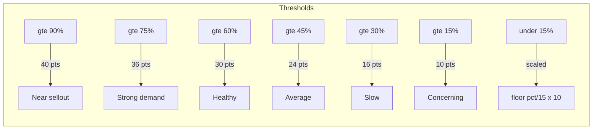
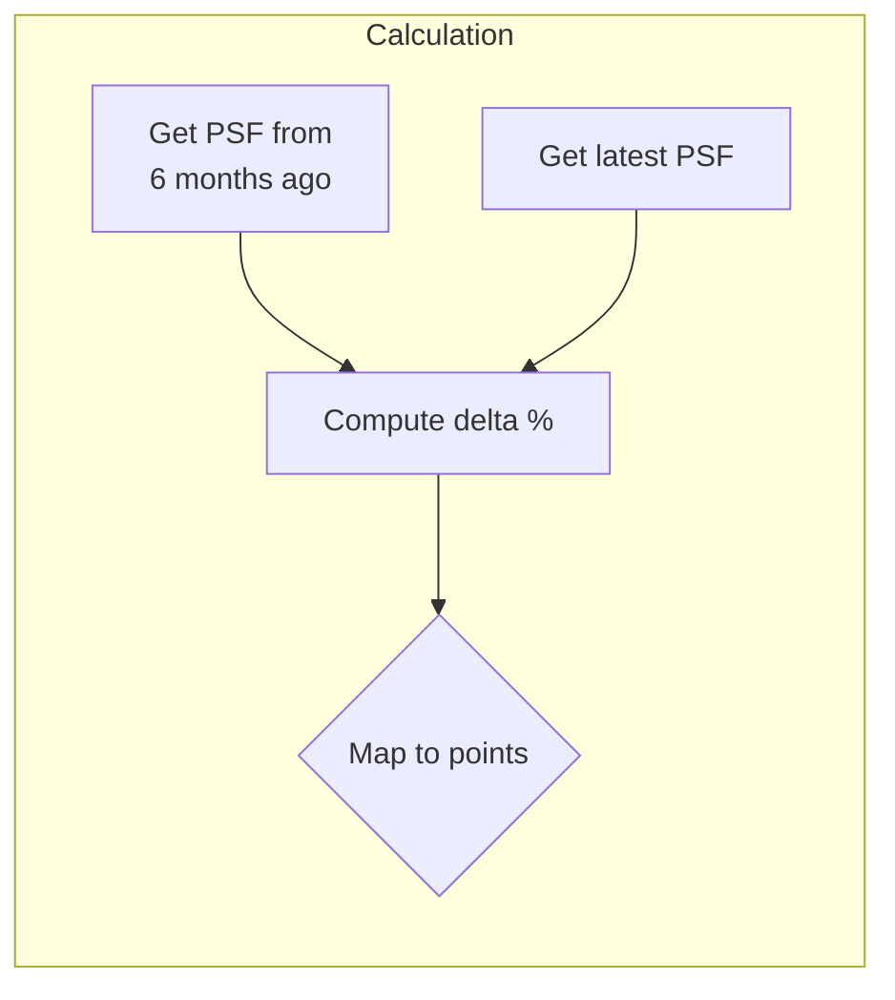
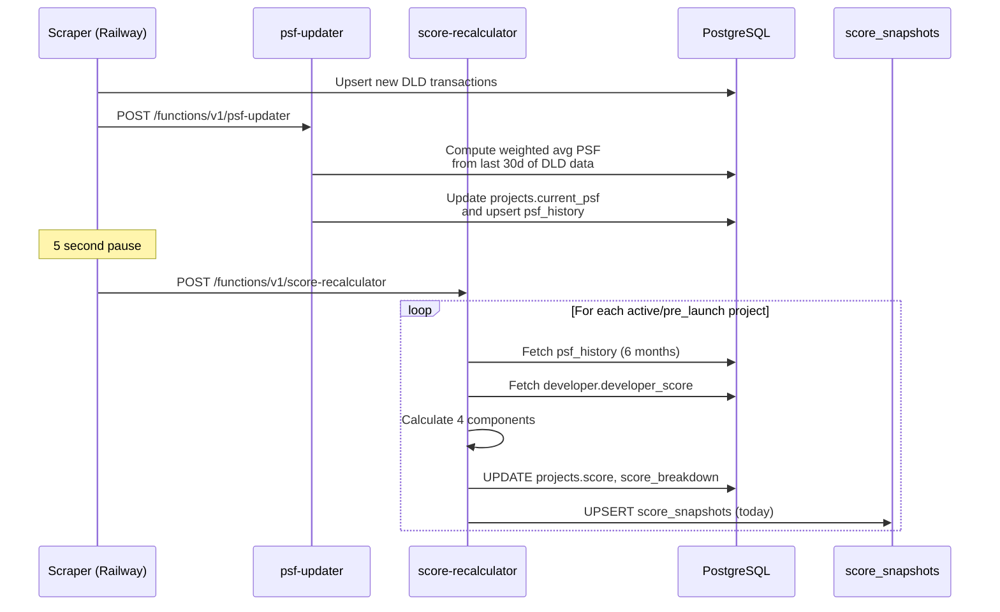

# Scoring Methodology

<p align="center">
  
</p>

> **The score is the product.** Every subscriber decision, alert, and digest is built on this number.
> It must be simple, transparent, and explainable to investors.

---

## Formula

```
Project Score (0-100) = Sell-through (0-40) + PSF Delta (0-30) + Developer (0-20) + Handover (0-10)
```

The score is computed after every scraper run by the `score-recalculator` Edge Function and stored in:
- `projects.score` — current score (0-100 integer)
- `projects.score_breakdown` — JSON with component values
- `score_snapshots` — daily history for trend charts

---

## Component 1: Sell-through (0-40 points)

**Signal:** Demand proof. How much of the project has been sold?

**Why 40% weight:** Sell-through is the strongest demand signal in Dubai off-plan. High sell-through means:
- Developer has pricing power
- End-user demand is real (not just speculative)
- Resale market will be liquid



**Implementation:** `scoreSellthrough(sellthrough_pct: number): number`

**Edge case:** Projects with 0 total units get `sellthrough_pct = 0` → 0 points.

---

## Component 2: PSF Delta 6-month (0-30 points)

**Signal:** Price momentum. Is the price per square foot rising or falling?

**Why 30% weight:** PSF appreciation is the primary return driver for off-plan investors. A project with strong sell-through but declining PSF is a warning sign.



| 6-month PSF Change | Points | Interpretation |
|-------------------|--------|---------------|
| ≥ +20% | 30 | Exceptional appreciation |
| ≥ +15% | 27 | Strong growth |
| ≥ +10% | 24 | Healthy growth |
| ≥ +7% | 21 | Above average |
| ≥ +5% | 18 | Moderate growth |
| ≥ +3% | 15 | Slight positive (neutral) |
| ≥ 0% | 12 | Flat |
| ≥ -3% | 8 | Slight decline |
| ≥ -7% | 4 | Significant decline |
| < -7% | 0 | Severe decline |

**Implementation:** `scorePsfDelta(psfHistory: PsfDataPoint[]): number`

**How base PSF is determined:**
1. Sort PSF history by date ascending
2. Find the most recent data point that is ≤ 6 months old
3. If no data is that old, use the earliest available data point
4. Fewer than 2 data points → return 15 (neutral)

**Data sources:** DLD transactions (primary, T+1), Property Finder listings (secondary, ~6h lag)

---

## Component 3: Developer Score (0-20 points)

**Signal:** Execution trust. Does this developer deliver on time with quality?

**Why 20% weight:** A project's score should be penalized if the developer has a track record of delays, RERA complaints, or quality issues. Conversely, a top-tier developer (Emaar, MERAAS) deserves a confidence boost.

**Mapping:** Linear — `round(developer_score / 100 × 20)`

| Developer Score (0-100) | Points (0-20) |
|------------------------|---------------|
| 100 (perfect) | 20 |
| 75 (good) | 15 |
| 50 (average) | 10 |
| 25 (poor) | 5 |
| 0 (terrible) | 0 |
| null (unknown) | 10 (neutral) |

**Developer score inputs:**
- `on_time_delivery_pct` — % of projects delivered on schedule
- `rera_complaints_count` — Total RERA complaints filed
- `rera_violations_count` — Regulatory violations
- `avg_quality_rating` — 1.0-5.0 from review aggregation
- `completed_projects` — Track record depth
- `avg_roi_pct` — Historical investor returns

**Implementation:** `scoreDeveloper(developerScore: number | null): number`

---

## Component 4: Handover Risk (0-10 points)

**Signal:** Delivery risk. Is this project on track for its handover date?

**Why 10% weight:** Delays directly impact investor ROI — especially with payment plan structures where post-handover payments are due on completion. A 12-month delay on a 40/60 plan means 12 months of extra carrying cost.

| Handover Status | Delay | Points |
|----------------|-------|--------|
| `on_track` | — | 10 |
| `completed` | — | 10 |
| `at_risk` | — | 6 |
| `delayed` | ≤ 90 days | 4 |
| `delayed` | ≤ 180 days | 2 |
| `delayed` | > 180 days | 0 |
| unknown | — | 5 (neutral) |

**Implementation:** `scoreHandover(handoverStatus, delayDays): number`

---

## Score Labels


| Label | Range | UI Color | Meaning |
|-------|-------|----------|---------|
| **Excellent** | 85-100 | `green-700` | Strong across all dimensions. High confidence investment. |
| **Good** | 70-84 | `green-600` | Solid fundamentals. Minor concerns in 1-2 areas. |
| **Watch** | 55-69 | `amber-700` | Mixed signals. Worth monitoring, not buying blind. |
| **Caution** | 40-54 | `orange-700` | Significant concerns. Deep due diligence required. |
| **Avoid** | 0-39 | `red-700` | Red flags in multiple dimensions. High risk. |

---

## Recalculation Pipeline



---

## Alert Thresholds

Alerts are triggered when a score change exceeds the user's configured threshold:

| Alert Type | Default Threshold | Trigger |
|-----------|------------------|---------|
| `score_drop` | 5 points | Today's score < yesterday's score by ≥ threshold |
| `score_rise` | 5 points | Today's score > yesterday's score by ≥ threshold |
| `handover_delay` | — | Status changed to `delayed` (deduped: once per 30 days) |
| `new_launch` | — | New project with status `pre_launch` |
| `psf_spike` | 5% | PSF increased ≥ threshold in one day |
| `psf_drop` | 5% | PSF decreased ≥ threshold in one day |
| `sellthrough_stall` | — | No unit sales in 30 days |

---

## Design Philosophy

1. **Explainable > Accurate** — A formula that investors understand and trust is worth more than a black-box ML model that's 5% more accurate.

2. **Conservative estimates** — When in doubt, give a lower score. It's better to under-score and surprise positively than to over-score and erode trust.

3. **Neutral for missing data** — Unknown developer gets 10/20 (not 0). Missing PSF data gets 15/30 (not 0). We penalize only what we can prove.

4. **Weights reflect investor priorities** — Sell-through (40%) because demand is king. PSF growth (30%) because that's the return. Developer (20%) because execution matters. Handover (10%) because delays are common but manageable.

5. **Tested at every threshold** — 31 unit tests cover every boundary in the scoring algorithm. See `apps/web/__tests__/scoring.test.ts`.

---

## Files

| File | Description |
|------|------------|
| `apps/web/lib/scoring/algorithm.ts` | Canonical scoring implementation (144 lines) |
| `supabase/functions/score-recalculator/index.ts` | Edge Function copy (must stay in sync) |
| `packages/shared/constants/index.ts` | `SCORE_WEIGHTS` and `SCORE_THRESHOLDS` |
| `apps/web/__tests__/scoring.test.ts` | 31 unit tests |
| `apps/web/components/project/ScoreBadge.tsx` | UI display component |
